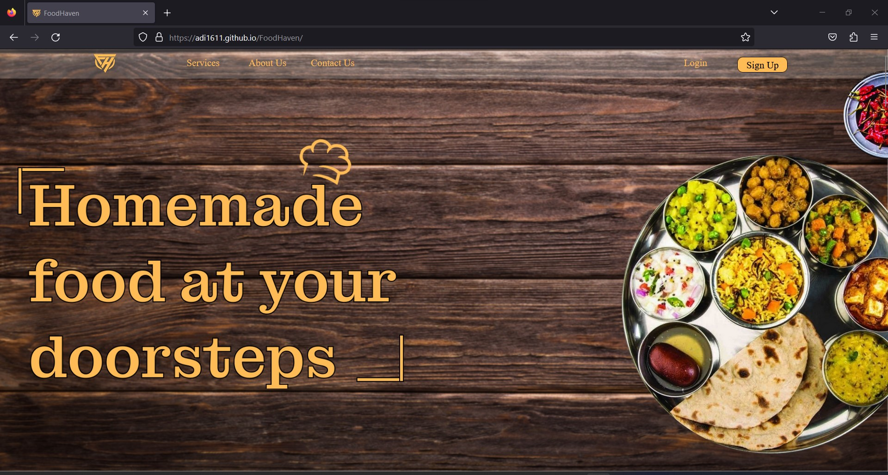
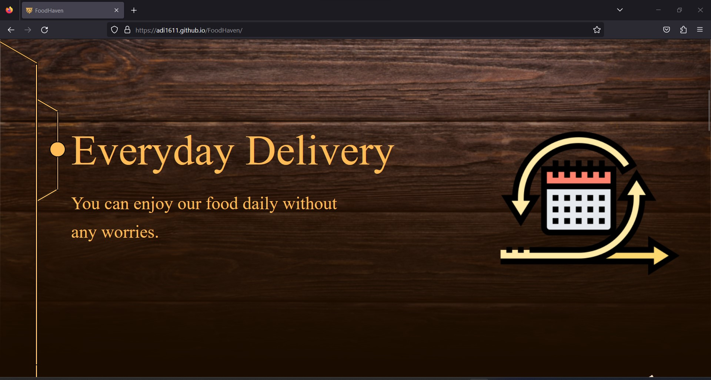
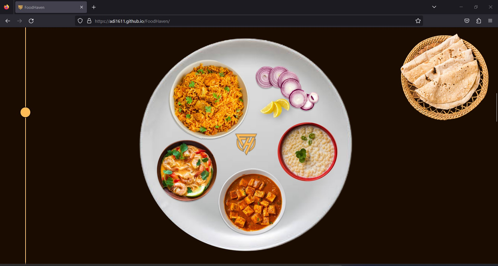

# FoodHaven Website

Welcome to the FoodHaven website! This is a responsive and visually appealing website that showcases the offerings of FoodHaven, a platform for food delivery. The website is designed to provide an easy-to-use interface for users to explore services, learn about the company, and contact them. This project highlight my UI/UX interface designing.

# Website Design at

https://adi1611.github.io/FoodHaven/

## Table of Contents
- [Description](#description)
- [Screenshots](#screenshots)
- [Usage](#usage)
- [Technologies Used](#technologies-used)
- [Contributors](#contributors)
- [License](#license)

## Description

FoodHaven's website is divided into several sections, each highlighting different aspects of their services. Here's a brief overview of the sections:

- **First Section**: This section includes the navigation bar with links to various pages, such as Services, About Us, Contact Us, Login, and Sign Up. It also features an eye-catching background image and the company logo.

- **Second Section**: Here, the website emphasizes the concept of everyday food delivery. Visual elements and text are used to convey the idea of hassle-free daily meals.

- **Third Section**: This section showcases an image of a delicious meal, creating a visual appeal and enticing visitors.

- **Fourth Section**: Highlighting the need for healthy food, this section emphasizes custom-made nutritious options.

- **Fifth Section**: The focus here is on the homemade feeling of the food, promoting a sense of comfort and warmth.

- **Sixth Section**: Delivery convenience is highlighted, indicating that users can enjoy FoodHaven's meals in the comfort of their homes.

- **Seventh Section**: This section emphasizes affordable pricing, making the value proposition clear to potential customers.

- **Footer Section**: The website's footer includes the company's logo and copyright information.

## Screenshots

Insert screenshots showcasing different sections of the website, such as:

## Usage

To view the website locally, follow these steps:

1. Clone this repository to your local machine.
2. Open the `index.html` file in a web browser.
3. Explore the different sections of the website and navigate through the links.

## Technologies Used

The FoodHaven website is built using the following technologies:

- HTML
- CSS
- JavaScript

## Contributors

This project was developed by [Aditya Kale](https://github.com/adi1611).

## License

This project is licensed under the [MIT License](LICENSE).
